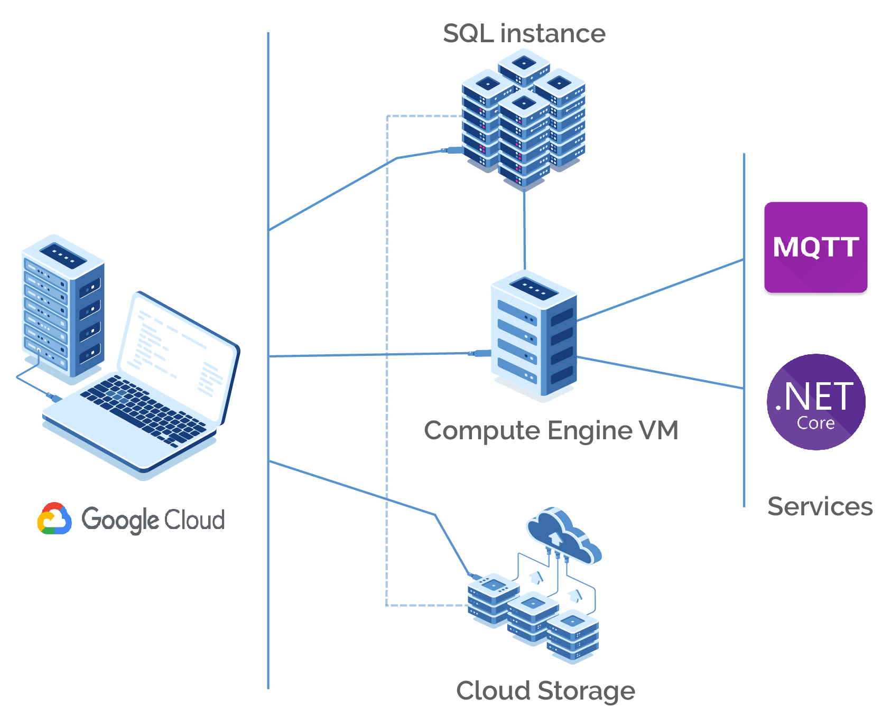

# City of Ideas - Devops

## Introduction
Deployment script - Script for deploying to Google Cloud using Compute Engine instance, MySql instance, Cloud storage.
    Contains also a MQTT broker that listens to topic KdG/Team10/CityOfIdeas.

## Technology
Following technologies are used:
* BASH

## How to run

To run successfully,you need to create a `user.txt` and `pw.txt` file in the home directory with ur username and password **and** you should provide an `env.json`and an `coi_env.json`file with some important parameters. **(see repository `mqtt` for more info)**  
It should look like this:     

**env.json**
```env.json
{
	"url": "mqtt://YOUR_IP:PORT",
	"username": "USERNAME",
	"password": "PASSWORD",
	"topic": "TOPIC",
	"appUrl": "http://IP:PORT/api" // e.g. http://localhost:5000/api
}
```
**coi_env.json**
```coi_env.json
{
	"Jwt": {
		"Key": "YOUR_SECRET_KEY",
		"Audience": "CityOfIdeas",
		"Issuer": "CityOfIdeas"
	},
	"Sqlite": {
		"ConnectionString": "Data Source=../db/CityOfIdeas.db"
	}, 
	"MySQL": {
		"ConnectionString": "YOUR_CONNECTION_STRING"
	},
	"SendGrid": {
		"User": "YOUR_USERNAME",
		"Key": "YOUR_SENDGRID_API_KEY"
	},
	"Facebook":{
		"AppId": "FACEBOOK_APP_ID",
		"AppSecret": "FACEBOOK_APP_SECRET"
	}, 
	"Google": {
		"ClientId":"GOOGLE_CLIENT_SECRET",
		"ClientSecret": "GOOGLE_CLIENT_SECRET"
	}
}
```
**(security reasons) `coi_env.json` en `env.json` kan je vinden in de upgeloaden zip file  bij `info` op Canvas. (security reasons)**

Afterwards, run the following commands in order to execute the script:
* `./newdeploymentscript`    --> Normal run
* `./newdeploymentscript -i` --> Import data from Cloud storage to MySql database instance.
* `./newdeploymentscript -d` --> Deletes Compute Engine instance, MySql instance, Firewall rules. It will ask to export database to Cloud storage.
* `./newdeploymentscript -da`--> Deletes Cloud Storage, static ip, Compute Engine instance, MySql instance, Firewall rules.
* `./newdeploymentscript -h` --> Display detailed help.


## Infrastructure


